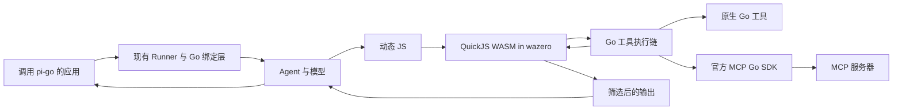

# pi-go 使用 wazero 实现 MCP Codemode 的设计方案

作者：Codex

更新日期：2026-10-02

状态：Accepted，已综合两份审核意见并获准分阶段实施；各阶段仍须测试与验收

讨论：本次 pi-go MCP 与 Codemode 设计讨论。最小闭环已合并；本轮继续实现 Pi 1.0 跟进计划的前六项，详见 [跟进表与当前执行合同](pi-1-followup.md)。下文阶段编号保留为原设计历史，后续交付按具体功能说明。

## Abstract 摘要

我们在 pi-go 中增加 MCP Codemode：外部应用提交任务，模型在运行时生成 JavaScript 编排代码，Go 宿主使用 wazero 执行固定版本的 QuickJS WASM。脚本调用已有 Go 工具或 MCP 工具，在执行环境内完成循环、并发及数据筛选，向模型返回受限输出。外部应用和下游 MCP 服务器均不需要理解脚本。

Codemode 行为参考 Pi v1.0.0 的源码与测试；MCP 协议采用官方 Go SDK v1.8.0，默认使用 2026-07-28 并与旧服务器进行标准协商。我们不移植 Pi 的旧协议客户端，也不自行实现另一套协议协商。

完整目标覆盖沙箱、工具策略、发现、执行链、连接、结果和会话存储。首个交付复用 PR14 的可选 MCP 工具适配层、调用方提供的会话和显式白名单，已跑通“模型生成脚本 → 受控子调用 → 有界结果”。本轮加入 raw/cache 合同、连接管理、动态目录、OAuth 和资源；分支持久化仍延后，不增加另一套任务 Runtime。图编排、多 Agent、Pi TUI、运行中 JS 栈的持久化和 Pi 的分类器、图片模型 API 不属于本轮范围。

## Background 背景

设计原始基线为 `master@4398f85`（v0.12.0），已在 2026-10-02 按依赖顺序合并 PR13、PR14，具备模型协议、单 Agent 循环、工具校验和 hook、ToolGate、会话日志、checkpoint 及可选 MCP 工具适配层。首轮实现从已提交设计的 `e4de3c8` 开始；MCP 连接管理与动态工具暴露注册层仍属后续阶段。

原基线的 `agent.RunToolCall` 复用参数处理与 before/after hook，但缺少 gate、父调用事件及共享调度；Go 执行错误会在 `executePreparedTool` 中变成文字和 IsError，原始错误及返回的部分结果丢失。它使用临时 Engine 和 Snapshot，不能直接充当 Codemode 子调用入口。首轮实现统一这一合同，保留机器可判断的错误、执行事实和 hook 后结果，并一次性迁移 executor 公共签名。

[PR14](https://github.com/Icatme/pi-go/pull/14) 已在 2026-10-02 合并，最终 head 为 `49910c79cf6266d0a29e31a26dfde39bb1536a64`，merge commit 为 `4398f8565ab82c460ddafc5fcfc20a35ef1187db`；先行依赖 PR13 已保留提交历史合并。其 `agent/mcptools.Discover` 提供显式 Names 白名单、参数和成功结果校验、schema 漂移拒绝、精度拒绝及执行后的 `ResultError`；不拥有连接、认证或授权。合并核查补齐了 examples 子模块的 x/sys 版本及校验和同步，根模块和 examples 全量测试、vet、构建、模块校验及 provider/Agent/MCP race 测试通过，Linux PR CI 通过。首个闭环以这个已合并适配层为代码基础，不复制另一套适配器；后文执行合同和 Codemode 运行时仍待实施与验收。

任务型外部接口与脚本执行接口属于不同层次。调用 pi-go 的应用继续提交任务、消费事件并获取结果；内部模型能够看到 Codemode 用法并生成代码。需要把 pi-go 再包装成 MCP 服务器时，由独立适配层提供任务工具，继续隐藏内部脚本细节。

## Design 设计

### 0 综合审核后的决定与首版边界

两份审核意见都接受 wazero + QuickJS WASM。以下合同纳入设计，并作为对应实现 PR 的验收门槛，不表示尚未实现的代码已经通过测试。

| 问题 | 合并后的决定 | 最早交付阶段 |
| --- | --- | --- |
| Go error 与 IsError 混淆 | 结果、失败类别、本地执行阶段、远程结局分别保留；JS 按类别 resolve/reject | M2/M3a |
| 嵌套 Suspend 与已发生副作用 | 首版明确拒绝；不产生可重放的外层 pending/checkpoint | M2 |
| 顺序语义与父子配额 | 保留模型整批 sequential；首版调用树仅有脚本父调用和宿主叶子工具 | M2 |
| raw 绕过 after hook | raw → 工具结果 → hook 后生效结果 → JS 投影；默认子事件也使用生效结果 | M2/M3a |
| JS 数值舍入 | 首版执行前后拒绝不安全 Number，沿用 PR14 的保守拒绝；完整 wire 精度另设门槛 | M1/M3a/M3b |
| 1024 次调用只记 256 次 | 全部已接纳调用保留基础台账，参数/正文详情单独截断 | M2 |
| VM 取消释放未退出工具配额 | VM 与宿主执行分别记账；宿主返回前不释放真实执行配额 | M1/M2 |
| SDK 缓存、raw、账号与目录 | 绑定同一版本快照；换身份重建 session；缺 raw 不伪造 | M3b/M4 |
| QuickJS 原生栈 | 显式调用栈限制 ABI，固定产物允许范围及可捕获递归异常 | M1 |
| 排队撤权与自动重发 | 实际发送前复核授权；分别控制 MRTR、OAuth、HTTP 重发 | M2/M3a/M4 |
| 分支提交竞争 | 延后持久化；存储层原子读快照、比较版本与追加 | M5 |

首版只接纳明确批准的叶子工具。工具集合在本次 Run 内固定，权限仍可撤回；不支持普通 Go 工具再次嵌套调用，不支持脚本递归调用 Codemode。MCP 会话、凭证、传输限额及关闭由调用方拥有，适配层不自动启动进程或登录。只使用可验证的无自动工具重发配置；普通只读目录加载不等于授权。

首版可实现白名单内的 ALL_TOOLS、搜索与描述；不承诺完整动态服务器发现、任意 raw 数值无损、资源获取、交互式 MRTR、跨 Run 的通用资源锁或分支 durable 恢复。未实现的能力不声明。只要最小闭环依赖执行链、事件、取消和数字合同，这些合同就不能推到后续扩展阶段。

### 1 固定技术基线并保留清楚的模块边界

| 组件 | 建议固定版本 | 维护与兼容性核查 | 用途 |
| --- | --- | --- | --- |
| Pi 行为参考 | v1.0.0 | 2026-10-02 北京时间发布 | 工具发现、脚本语义和会话行为的参考 |
| MCP Go SDK | v1.8.0 | 最近提交 2026-10-01，要求 Go 1.25 | 协议、传输和 OAuth 基础设施 |
| wazero | v1.12.0 | 发布 2026-05-29，最近提交 2026-09-28，要求 Go 1.25 | 在 Go 进程中运行 WASM |
| quickjs-wasi | 3.6.2 | npm 发布及最近提交 2026-09-19 | 提供 QuickJS WASM 与稳定的桥接 ABI |
| pi-go | 当前工作区 v0.12.0 | go.mod 为 Go 1.26.2，本机 Go 1.26.4 | 宿主与 Agent 集成 |

截至核查时间，上述拟采用第三方组件没有超过半年未维护的情况。升级必须检查版本变更、Go 要求、目标平台问题与 ABI 差异，不能使用运行时自动下载或浮动 `latest`。quickjs-wasi 的 npm 发布是 3.6.2，GitHub `releases/latest` 的缓存页面仍可能显示 3.6.0；版本判断以精确 tag、包元数据和文件摘要为依据。

来源：[Pi 1.0](https://github.com/earendil-works/pi/releases/tag/v1.0.0)、[MCP SDK 1.8](https://github.com/modelcontextprotocol/go-sdk/releases/tag/v1.8.0)、[wazero 1.12](https://github.com/wazero/wazero/releases/tag/v1.12.0)、[quickjs-wasi 源码](https://github.com/vercel-labs/quickjs-wasi/tree/5a7a0eeda87c99542f8cf3095b6d61ecfa755977)、[npm 元数据](https://registry.npmjs.org/quickjs-wasi/3.6.2)。最近提交日期通过 GitHub API 核查，后续实施前再次核查。

包布局如下。首轮实现独立沙箱、内部 ABI/资产和 Agent 绑定；后续包仅在对应阶段增加。

```text
pkg/pigo/                         模型元数据、认证、provider 协议及流式输出
agent/                            单 Agent 循环与通用工具执行生命周期
codemode/                         沙箱、源码选项、声明和发现数据结构
codemode/internal/quickjs/         ABI、句柄、内存与 Promise 桥接
codemode/internal/assets/          固定 WASM、许可及版本摘要
agent/mcptools/                   复用 PR14；MCP 结果到 ToolDefinition 的适配
agent/codemodetool/               脚本工具、当前 invocation 与子调用链的连接
examples/mcp-codemode/            本地工具与 MCP 组合示例

后续需要时才增加：
mcp/                              连接、认证、raw 观察及目录快照
agent/toolset/                    动态工具暴露策略、发现与请求投影
examples/mcp-agent-server/        可选的对外 MCP 任务工具示例
```

`codemode` 及后续的 `mcp` 均不依赖 `agent` 或 `pkg/pigo`。`agent` 核心只提供执行事实、共享生命周期及受限子调用能力，不认识 JS、MCP、BM25 或 exposure。应用使用现有 Runner 组装，配置显式传入；不先创建庞大的管理层或修改 `pkg/pigo` 的职责。

### 2 外部应用提交任务，内部模型生成代码



首版继续使用现有 `agent.Runner`、`agent.RunStream` 的 Events、Wait 和 Close。应用创建长生命周期 Sandbox 和共享资源预算，提供已连接的 MCP session，通过 `mcptools.Discover` 选择白名单，再把 Codemode 工具接入 Runner。构造时验证配置；每次脚本单独创建 VM，每次 Run 单独绑定身份、工具集合、hooks、事件及取消，不共享可变 invocation。

不增加另一套 `Runtime.Run`、任务请求类型或 Agent 循环。高级用户可以直接使用低层 `codemode.Sandbox.Execute`；普通应用继续提交任务，无需提供 JS。调用方持续消费 Events，再 Wait；放弃执行时调用 Close。流结束只说明 Agent 和 VM 已结束，宿主工具是否全部退出由第 4 节的收尾报告说明。

向外包装为 MCP 服务器属于可选示例。它提供 `run_task({goal, session_id?})` 一类工具，返回 run_id、状态、摘要、结构化数据与必要的产物引用。策略和凭证由服务端配置，调用方通过身份映射获得相应执行域。脚本及子调用详情通过受控 trace 查询；默认响应不携带代码。首个示例采用同步调用和取消传播，不宣称支持 Tasks 扩展。

### 3 一个脚本使用一个独立 WASM 实例

wazero 执行 WASM，而 QuickJS WASM 解释 JS。Go 负责宿主函数、事件循环和资源控制。这条路线不需要 Node 或 CGO；依赖的 MCP stdio 服务器仍可能自行需要 Node、Python 或其他环境。

我们嵌入已核查的 quickjs-wasi 3.6.2 产物，不移植其 TypeScript 包装器。发布文件中保存来源、版本、许可证与摘要。本次原型 WASM 大小为 637405 字节，SHA256 为：

```text
d4c9375f2b1ca4dc95f72c8aa2982a7a9951ac8011490d79c6582df732b4bbd9
```

Go 桥接仅使用该固定 ABI。保留的 JS 句柄必须明确所有权和释放位置；宿主回调参数默认视为借用。字符串使用显式长度，保留 NUL；存储长度遵守 JS 字符单位。所有 WASM 指针、长度和读写都检查边界。

每段脚本新建独立 WASM module instance 和 QuickJS runtime/VM，结束后关闭该 instance；Sandbox 可共用 wazero 执行基础设施和编译缓存，不复用带用户状态的 module/VM。取消一段脚本不能关闭其他脚本或整个共享 runtime。编译缓存先使用内存缓存，不自动写用户目录。

配置启用 `WithCloseOnContextDone(true)`，为线性内存设置 `WithMemoryLimitPages`，通过 QuickJS ABI 设置 JS 堆上限。另在 `qjs_init` 后、任何用户代码之前调用 `qjs_set_max_stack_size`。三者分别约束线性内存、JS 堆和 QuickJS 原生栈，不能相互代替。

固定产物的 linker 栈为 1 MiB；quickjs-wasi 上游允许的 `MAX_STACK_SIZE` 为 512 KiB，保留另一半用于原生帧及异常处理。首版默认 QuickJS 原生栈上限 512 KiB，配置只允许正整数且不超过该固定产物上限；拒绝 0，避免关闭保护。升级产物同时重查 linker 栈、ABI 和安全余量。WASM 内存默认不预分配最大值。

验收必须证明深递归在 guest 内抛出可捕获异常，catch 后普通运算仍能成功，不能用 WASM trap、Go panic 或整个进程退出代替。此次新增 Windows 原型在 64 KiB 和 512 KiB 两个设置下均捕获 `RangeError: Maximum call stack size exceeded`，随后计算得到 3；还需成为仓库内固定产物测试，并在目标平台运行。

WASI 不挂载文件系统、不继承环境变量及标准输入、不提供套接字能力。只注册固定 WASM 所需的最小 imports，禁止动态模块加载和访问未知宿主函数。guest 中不提供 fetch、process、require、定时器或 WebAssembly。宿主有权调用的工具仍由工具策略决定。

来源：[wazero 配置与取消](https://github.com/wazero/wazero/blob/v1.12.0/config.go)、[Pi 沙箱宿主](https://github.com/earendil-works/pi/blob/v1.0.0/packages/codemode/src/runtime/host.ts)、[quickjs-wasi ABI 文档](https://github.com/vercel-labs/quickjs-wasi/blob/5a7a0eeda87c99542f8cf3095b6d61ecfa755977/README.md)、[上游栈配置](https://github.com/vercel-labs/quickjs-wasi/blob/5a7a0eeda87c99542f8cf3095b6d61ecfa755977/src/index.ts)、[linker 栈](https://github.com/vercel-labs/quickjs-wasi/blob/5a7a0eeda87c99542f8cf3095b6d61ecfa755977/Makefile)。

### 4 VM 由一个 goroutine 操作，Go 工具可以并发

每个执行域设置一个 VM owner goroutine，负责 WASM 导出函数、脚本及 QuickJS pending jobs。任何工具 goroutine 都不能调用 VM。Sandbox 的编译缓存与宿主预算由应用长期持有；同一服务的所有 Run 必须共用宿主预算，不能每次 Run 新建预算来绕开限制。

执行过程如下：

1. JS 调用 `tools.name(args)`，prelude 创建 Promise 和 call id。
2. host callback 将参数复制到有界队列，完成必要的长度检查，然后返回。
3. 宿主分配不可伪造的子调用 ID，并在接纳前预留基础台账位置、队列和字节预算。
4. Go 子调用经过第 6 节的执行链；生效结果和机器错误经过限额检查后才进入完成 channel。
5. VM owner settle Promise，并继续运行 pending jobs。

`Promise.all` 请求可以同时等待，实际执行数量及顺序受第 6 节约束。队列已满时立即返回明确错误，host callback 不能等待队列而阻塞 VM owner。预算覆盖入队前的参数复制、结果序列化及完成队列的累计字节；不能先无界复制，再统计桥接量。

VM 调用、microtask 和排队使用同一有效执行 context。脚本取消或结束时停止新接纳，取消排队和活动工具，关闭实例并撤销结果投递权。未等待的调用也取消。迟到结果不得访问已关闭 VM 或向已关闭 Agent 流发送事件。

VM 名额在实例实际关闭后释放；宿主执行名额在相应 Go Execute、必要的结果处理和收尾实际退出后释放。VM 返回、context 取消或 Promise 被丢弃都不能提前释放宿主名额。尚未退出调用转交共享预算的活动调用表，继续占名额；其远程结局保守记为 unknown，之后得到可靠终态时再更新宿主记录。取消后的脚本报告与宿主收尾报告分别保留，不能把前者改写成“远程确定未执行”。

Sandbox 的关闭入口接收有界收尾 context：停止接纳、取消执行、等待实际退出；期限届满返回明确的未退出调用清单和关闭错误，不无限等待，也不返回“全部关闭成功”。未退出调用的跟踪与配额继续由预算所有者持有，直至真正退出。调用方拥有 MCP session 或子进程时负责关闭这些资源；首版适配层不能越权关闭调用方会话。

工具函数必须尊重 context；Go 无法强行终止任意 goroutine。带阻塞 I/O 的宿主工具需要可取消 I/O 或自身进程管理。WASM 上限也不会约束 Go 在工具执行过程中分配的所有内存，因此宿主输入、结果、并发和记录都需要单独的界限。

### 5 脚本 API 保持小而明确

首个实现提供以下全局对象。脚本作为 async 函数体执行，允许顶层 await 和 return。

| API | 行为 |
| --- | --- |
| `tools.<name>(args)` | 调用当前允许的工具，返回 Promise |
| `ALL_TOOLS` | 同步只读快照，成员仅为 `{name, description}` |
| `searchTools(query, options?)` | 返回 Promise，resolve 为允许集合内的 BM25 摘要数组 |
| `describeTool(name)` | 返回 Promise，resolve 为说明和调用声明；不可见/不存在时为 undefined |
| `describeNamespace(name)` | 返回 Promise，resolve 为命名空间说明和允许工具列表；不可见/不存在时为 undefined |
| `text(value)` | 追加字符串或 JSON 文本输出 |
| `image(value)` | 验证并追加支持的图片内容 |
| `console.*` | 追加受输出限制约束的文本 |
| `exit()` | 成功结束当前脚本 |
| `return value` | 将非 undefined 的返回值按 text(value) 追加到输出，使用同一预算 |
| `store(key, value)`、`load(key)` | 同步复制 JSON 值；首版限本次 Run，M5 才提供分支持久化 |

工具名保留稳定的原始名称和 JS 标识符映射。MCP 名称采用 `mcp__server__tool`，满足 provider 的 64 字符限制；过长或清洗后冲突时使用 server/tool 身份生成确定 hash 后缀，检查最终唯一性。配置命名空间冲突直接报错。调用未知成员产生明确错误，名称提示只包含当前允许集合；使用 `"name" in tools` 判断存在性。隐藏与不存在工具的描述均为 undefined，避免泄露隐藏目录。主机每次真正执行再次检查权限，不能信任 frozen 对象或 Proxy。

支持首行选项：

```javascript
// @options: {"max_output_tokens": 2000, "timeout_ms": 30000}
const results = await Promise.all([
  tools.mcp__github__get_issue({ owner: "example", repo: "project", issue_number: 1 }),
  tools.mcp__github__get_issue({ owner: "example", repo: "project", issue_number: 2 }),
]);
const open = results
  .filter(r => !r.isError && r.structuredContent?.state === "open")
  .map(r => ({ number: r.structuredContent.number, title: r.structuredContent.title }));
text(open);
```

例子假设工具存在且提供相应 structuredContent；实际脚本先 await 发现 API。未知选项、无效值报错，替换选项行时保留换行以维护源码行号。脚本 timeout 只能缩短宿主期限。顶层 return、text、console、image 共用输出计账，不给 return 单独的无界通道；不支持的 JSON 值明确报错。

图片接受 PNG、JPEG、GIF、WebP 的有效 base64 数据，声明 MIME 与数据不符时返回错误。首个版本不提供 `models.classify` 或 `models.generateImages`；工具描述也不宣传这些能力。以后接入时另行扩展 `pkg/pigo` 的真实模型协议能力。

来源：[Pi Codemode 用法](https://github.com/earendil-works/pi/blob/v1.0.0/packages/coding-agent/docs/codemode.md)、[源码选项](https://github.com/earendil-works/pi/blob/v1.0.0/packages/codemode/src/source.ts)、[脚本 prelude](https://github.com/earendil-works/pi/blob/v1.0.0/packages/codemode/src/runtime/prelude-source.ts)。

### 6 执行生命周期、错误和嵌套审批的确定合同

通用执行链必须覆盖模型直接调用和脚本子调用：

```text
接纳与基础台账 → 工具解析 → 参数/schema 校验
  → before hook → 修改后的参数再次校验 → ToolGate
  → 调度排队 → 取得叶子工具名额 → 实际执行前授权复核
  → Execute（MCP 目录复核后、CallTool 前再检查授权）
  → 规范化结果并保留执行错误/事实 → after hook
  → 生效结果 JSON/成功输出 schema/数字检查 → 有界事件与 JS 投影
```

#### 6.1 一条执行链及最小核心修改

模型直接调用与脚本子调用共享参数处理、hooks、gate 和结果规范化；保留当前 before/after 的实际执行语义。`RunToolCall` 不再临时拼一个绕过 gate/执行域的路径。执行入口显式绑定当前 invocation 的工具集合、hooks、身份、取消、父调用和事件策略。

M2 在合同确定后才调整 executor 所需的 `ToolExecutionContext`，包含当前 call、已校验参数、AgentContext、OnUpdate 及受限 ChildCaller；后者首版仅授予脚本容器工具，宿主叶子工具不获得它。一次性更新必要调用者，不保留旧/新两套 executor，也不把全仓签名迁移作为 M1 独立沙箱的前置条件。

外层仅能调用模型集合，ChildCaller 仅能调用脚本白名单。子 ID 由宿主生成，例如 `outer/1`；不能从 JS 参数读取父 ID、身份或审批结论。只增加 `ParentToolCallID` 不够：嵌套事件必须在 clone/enqueue 前走摘要投影，详见第 9 节。子结果不追加为独立模型工具消息。普通 MCP 没有标准 LLM usage 时不推算 token 费用。

#### 6.2 错误与执行事实分离

给内部 outcome、`ToolCallOutcome` 及可序列化工具记录增加明确的失败类别和执行信息；原始 Go error 作为非序列化字段保留，支持 `errors.Is/As`。模型仍看到正常 ToolResult 文本和 IsError，但不以它们推断是否执行、是否可重试。当前 `AgentEvent.Err` 不能替代这一合同，它不会随工具消息持久化。

最低执行信息为：local = not_started/entered/returned；remote = not_dispatched/complete_reported/input_required/unknown/not_applicable。entered 只表示进入本地 executor，不表示 MCP 已发送；本地 returned 仍可能对应 remote unknown。每个物理发送 attempt 单独记账，不能把一次 CallTool API 调用当作“恰好发了一次 POST”。

| 类别 | 例子和事实 | JS 处理 |
| --- | --- | --- |
| argument_invalid / policy_denied / schema_changed | 校验失败、撤权、目录漂移；该工具 RPC 未发送 | reject，携带明确 code 和执行信息 |
| nested_suspend_unsupported | 子 gate 返回 Suspend；此前其他调用可以已经完成 | reject；保留此前台账，不建立 pending |
| tool_reported_error | MCP 最终 CallToolResult.isError=true；已收到终态响应 | resolve 生效 envelope，保留 isError |
| result_rejected | 远程终态已收到，但精度、schema、类型或结果预算不通过；保留 unsafe_number 等原因码 | reject；不得解释为远程操作失败 |
| input_required_unsupported | 首版收到非终态输入请求 | reject，记录非终态；不自动续接 |
| transport / protocol | 工具请求可能已送达，无法证明未执行 | reject；remote 保守记 unknown |
| canceled / deadline | 排队前取消与发送后取消分别记录 | reject；依据实际发送事实决定 not_dispatched 或 unknown |
| hook / resource / script / sandbox | hook、预算、脚本或 WASM 失败 | 保留已发生事实；工具失败或脚本失败分别呈现 |

PR14 的 `ResultError` 必须在共用执行链中保留错误链和有界部分结果；接入时给适配层的前置拒绝、CallTool 失败、输入请求及终态映射失败补机器分类。不能根据 Error() 中的“do not retry”等文字猜类别。没有可靠发送证据的普通 Go error，保守视为进入 executor 后结局未知。

after hook 可以改生效内容和业务 IsError，不能删除或改写执行事实。若 hook 失败，也保留原始执行错误链和远程状态，JS/默认事件使用 hook 后允许的错误文本，不暴露未处理结果。MCP 的 isError resolve 规则只用于完整 MCP 结果；基础设施失败不能因为 IsError 被改成 false 而变成成功。

JS reject 的 Error 除受限 message 外，提供稳定 code、callId 和 execution 信息。首版对工具及整段脚本均不自动重试；未来重试必须显式证明操作允许重复或未发送，不能用 annotations、Go 错误类型或本地取消单独推断安全。

#### 6.3 审批恢复

外层模型批次保留当前 gate 合同：整批准备完成前不执行任何工具，任一 Suspend 产生当前 pending；普通静态工具的 durable 恢复不受影响。尚未开始的外层 Codemode 可以按批次合同在当前进程恢复，首版不承诺把它配置到 durable checkpoint。脚本子调用只支持 Allow/Block；收到 `ToolGateActionSuspend` 时返回 `nested_suspend_unsupported`。它不会让已经执行的外层脚本成为“尚未执行”的 pending，也不会进入现有 checkpoint 恢复入口。

第一个写操作成功、第二个要求 Suspend 时，第一个仍记成功，第二个记未发送；后续任何恢复入口都不得重复第一个写操作。JS 可以捕获该拒绝并输出已完成结果，但不能通过捕获创建持久化续执行。首版不提供进程内交互审批等待；以后若需要，另加保持当前 VM/Promise 的审批接口，且不重放脚本，进程退出明确中断。

权限复核放在取到执行名额后，并在适配层目录复核完成、紧邻 CallTool 时再次进行。排队期间撤权必须阻断该调用。审批结果绑定身份、工具/schema 版本和最终参数；参数或政策改变就失效，不重复索取仍有效的同一审批。传输内排队、OAuth 重发或 MRTR 续接也必须检查最新身份和授权。已送达的操作不能靠撤权保证回滚。

#### 6.4 顺序与并发：首版限定两层调用树

现有 Agent 规则原样保留：definition 为 Sequential，或一个模型批次含任意 Sequential 工具，整个模型批次顺序执行。首版 Codemode 自身标记 Sequential，因此与其同批的外层普通工具不会并发执行；这是一项明确的保守限制。

脚本父调用只占 VM 名额，不占宿主叶子工具的并发名额。每个子调用拥有独立 ticket；等待中的 JS Promise 不持有叶子名额。definition 为 Sequential，或固定白名单内含任意 Sequential 工具时，该脚本全部子调用按接纳顺序串行；definition 与白名单全部允许 Parallel 时才允许最多 16 个叶子并发。这比动态穿插顺序/并发工具更保守，防止逐步产生调用时削弱原有排他性。

只有当前串行子调用实际退出后才允许下一兄弟调用启动；取消不能提前交出名额。兄弟调用不能共享父 ID 借用同一个执行权。脚本不是占着宿主名额等待孩子的 Go 父 executor，因此不会出现 16 个父 executor 占满 16 个名额后等孩子的路径。

普通 Go 工具的再次嵌套属于明确不支持能力，首版不给它 ChildCaller。以后若开放更深调用树，先实现显式等待时执行权转移/收回、深度界限和活动宿主记账，再验证“顺序父调用等孩子”“16 个父调用占满配额等孩子”“兄弟不得共借父身份”，不能直接打开首版限制。

调度隔离范围为单 Run；共享预算只限制总资源，并不提供跨 Run 的浏览器/设备互斥。跨 Run 访问同一资源由应用串行化或提供其已有资源锁，首版不创建通用资源锁管理器。运行中新增工具或修改 ExecutionMode 不直接加入当前 VM；需在下一次执行建立新集合。

### 7 注册、发现、声明和执行分别使用明确集合

`agent/toolset` 保存规范工具记录、命名空间、来源、原始 schema、连接状态、exposure 和策略 revision。每个请求生成不可变的声明投影；每次真正执行都复核最新可调用状态。即使 prompt 仍含旧工具名，隐藏或撤回的工具也不会被执行。

| MCP exposure | 默认模型声明 | 搜索加载后直接调用 | 脚本调用 |
| --- | --- | --- | --- |
| direct | 是，按 active 状态 | 已声明 | active 时可用 |
| deferred | 否 | 可以 | 可以 |
| codemode | 否 | Pi 中也可被 tool_search 加载；Go 保留此行为 | 可以 |
| hidden | 否 | 不可以 | 不可以 |

Pi 1.0 的 MCP 配置只有四种正式模式；`codemode-deferred` 是旧配置别名。全新的 Go API 不保留该别名。MCP 的 codemode 在 Pi 通用 exposure 中映射为 deferred，因此 MCP 工具默认不进入 Codemode 的逐工具声明。提示只描述命名空间，脚本按需发现。原生 Go 的未直接声明工具可以使用通用声明预算，默认参考 3000 个估算 token；不要把这个预算说成默认注入 MCP 的全部 schema。

策略计算顺序是精确工具名、按配置顺序的第一个匹配模式、服务器默认值。Go 规范结构采用 Exact map 与 Patterns slice；读取 Pi 风格 JSON 对象时保留成员顺序，不能用普通 map 的迭代顺序实现“第一个匹配”。匹配只支持文档规定的 `*`。

hidden 从声明、BM25、ALL_TOOLS、描述 API、命名空间工具列表和调用解析中排除。服务器默认 hidden 时，只通过单工具 override 开放白名单。整个服务器 hidden 时，资源入口也不能绕过策略访问它。管理接口仍可查看完整目录；`enabled: false` 控制关闭连接，含义独立。

ALL_TOOLS 是执行开始时的目录快照。运行期间改变策略会阻止新的调用；已经交付给 VM 或历史 prompt 的说明不会自动消失。这个机制也不会撤销已经发生的外部操作。

BM25 初版移植 Pi 的 tokenizer 与排序规则，默认 limit 8，保持稳定的 tie 顺序。查询内容覆盖工具名、说明、schema 字段及命名空间说明。中文搜索质量属于单独需求，不在第一版暗中替换 tokenizer 或增加向量检索。

动态 `tool_search` 选择影响下一次模型请求；M4 先保存在隔离的 Run 中，M5 才按分支提交。服务器重连后重新绑定保存名称，目录尚未加载时不删除选择；hidden 或真实撤回时禁止执行。已有 system transcript 的工具新增、移除机制用于投影变化。白名单首版无需依赖动态目录或持久化才能运行。

来源：[Pi MCP exposure](https://github.com/earendil-works/pi/blob/v1.0.0/packages/coding-agent/src/core/mcp-servers.ts)、[MCP 到通用工具的映射](https://github.com/earendil-works/pi/blob/v1.0.0/packages/coding-agent/src/extensions/mcp/tools.ts)、[Codemode 声明投影](https://github.com/earendil-works/pi/blob/v1.0.0/packages/coding-agent/src/extensions/codemode/tool.ts)、[工具搜索](https://github.com/earendil-works/pi/blob/v1.0.0/packages/coding-agent/src/extensions/tool-search/tool.ts)。

### 8 MCP 会话、协议续接及自动重发分阶段接入

M3a 只复用 PR14，接受调用方已建立、固定身份的 SDK session；空白名单不做 I/O。M4 才在 `mcp` 包接入连接状态 configured、connecting、connected、needs-auth、failed、closed，状态管理只围绕会话生命周期，不扩成新的 Agent Runtime。新配置仅支持 stdio 和 Streamable HTTP，不增加旧 SSE 入口。

构造 Client 时显式声明实际 capabilities，不采用默认 roots 声明。不设置旧 ProtocolVersion，交由 SDK 的 discover/initialize 逻辑协商。当前服务器版本、身份与 capabilities 保存在 host 中，供诊断及目录管理使用。

| 2026-07-28 变化 | 我们的适配责任 |
| --- | --- |
| 无协议会话和 initialize 握手 | 用 SDK 的连接状态，避免自行依赖 Mcp-Session-Id |
| 每请求版本与 capabilities | 由 SDK 填充，脚本不能注入认证或协议身份 |
| subscriptions/listen | 注册目录变更 handlers，让 SDK 订阅并触发刷新 |
| 缓存有效期与 cacheScope | 认证身份、服务器和协议共同参与缓存分区，通知使缓存失效 |
| resultType 和 MRTR | 只有 complete 才交给脚本；input_required 进入输入处理阶段 |
| 任意 JSON structuredContent 和 JSON Schema 2020-12 | 保留原始 JSON 和 schema，不要求结果是对象 |
| 取消、断流与新的请求 ID | 确认逻辑调用状态，执行状态未知时不自动重跑写工具 |

M3a 显式关闭 SDK 自动 MRTR，未配置 sampling、elicitation 或 roots 等特权回调；input_required 返回 `input_required_unsupported`，不声明或实现交互续接。M4 有对应测试和应用 handler 后，才通过 NeedsInput、InputRequests、RequestState 和 InputResponses 支持同一逻辑调用的续接。只声明真实实现的能力，当前协议弃用的 Roots、Sampling、Logging 不作为首版扩展目标。

未来显式输入处理最多 10 轮；空 inputRequests 表示服务繁忙，返回明确错误，不自动重发。等待输入计入原调用期限；无 handler 或用户拒绝时按协议提供拒绝结果或终止调用，不替用户填写输入。每轮继续前再次检查身份、授权和取消。

协议续接使用同一次逻辑子调用的记录、超时和取消，发送新的 RPC 请求并带正确 state。必须校验输入类型、长度及轮数，明确拒绝无法处理的请求。它不属于网络失败后的工具重试；网络失败或响应不明不会触发整段 JS 重放。

目录快照原子替换，撤回工具阻止未开始调用。初次模型请求只等待需要直接声明的 direct 工具，最多 10 秒后明确报告未就绪。deferred/codemode 工具不阻塞首个模型请求，在发现或调用时按需等待，并受原 context 限制；连接超时不能被当作“该服务器没有工具”。

#### 8.1 关闭 MRTR 不等于关闭 OAuth/HTTP 重发

SDK v1.8.0 的 Streamable HTTP transport 在 401/403 且 OAuthHandler.Authorize 返回 nil 后，会再发送一次原 POST；这独立于 MRTR。首个受支持闭环不启用这种 tools/call challenge 重发。调用方先完成认证，工具发送阶段只使用已绑定身份的凭证；若提供 OAuthHandler，其工具请求 Authorize 必须返回“需重新认证”的明确错误，而不能返回 nil 触发重发。

HTTP 构造合同还要求禁止 MCP POST 的自动重定向重放，不添加使非幂等 POST 自动重试的配置，不使用会重试 tools/call 的 HTTP 中间件。受控发送边界记录逻辑 call、RPC ID 和物理 attempt；任何额外 tools/call attempt 都必须有显式批准的续接原因，否则阻断。接收任意 caller-owned session 的适配器无法检查其私有配置，不能单靠一次 Execute 或 CallTool 调用承诺 at-most-once；支持的会话构造及传输配置必须在示例和永久测试中落实。

以后如允许 OAuth challenge 后重发，先证明该操作在此种响应下不会已执行，或由服务器提供可验证的幂等合同，再对每个 attempt 重新授权并记账。网络失败、断流、取消和身份切换不能触发自动重放。SDK 某些 `ErrRejected` 包装用于连接管理；不能据此或“client.Do 返回了 error”断言远程没执行。

认证与全局/项目配置加载留在应用层。library 默认不读 home、不执行环境变量命令；项目启动命令需要应用提供 trust 结果。OAuth 扩展使用 SDK auth/oauthex，对服务器、issuer、用户、client 和 scope 绑定凭证，处理 iss 校验与 scope 变化；凭证不进入沙箱、目录声明或默认 trace。

#### 8.2 身份切换必须更换实际会话

执行 Scope 至少包含可信的用户/租户、服务器、认证 epoch、Run，以及后续的会话/分支；它由应用身份映射赋值，不能取自脚本参数。SDK session 及其凭证 transport 绑定一个身份 epoch。账号、issuer 或有效授权范围改变时，停止旧 epoch 接纳、取消其未开始调用、隔离活动调用记录，关闭/退役旧 session 并创建新 Client/session；不能只换外层缓存键，继续使用含旧工具缓存的 session。

目录、raw 绑定、声明/搜索选择、store 和产物访问都按 Scope 隔离。旧 epoch 的迟到响应只属于旧调用，不进入新目录或 VM。SDK 的 cacheScope=public 也不授予工具或产物访问权限；首版不跨身份共享目录缓存。

来源：[最新 MCP 规范](https://modelcontextprotocol.io/specification/2026-07-28/changelog)、[SDK 版本协商](https://github.com/modelcontextprotocol/go-sdk/blob/v1.8.0/mcp/client.go)、[SDK MRTR](https://github.com/modelcontextprotocol/go-sdk/blob/v1.8.0/mcp/mrtr.go)、[SDK OAuthHandler 合同](https://github.com/modelcontextprotocol/go-sdk/blob/v1.8.0/auth/client.go)、[HTTP challenge 重发实现](https://github.com/modelcontextprotocol/go-sdk/blob/v1.8.0/mcp/streamable.go)、[OAuth 扩展](https://github.com/modelcontextprotocol/go-sdk/tree/v1.8.0/oauthex)。

### 9 四层结果、数值边界及 raw/缓存绑定

#### 9.1 权威结果是 after hook 后的生效结果

```text
raw wire JSON → 受校验的 ToolResult → 规范化及 after hook → 生效 ToolResult
                                                        ├→ JS 值/envelope
                                                        └→ 默认子事件摘要
```

| 层次 | 用途与限制 |
| --- | --- |
| 原始 wire JSON | 精度检查、受控诊断；保存产物须单独授权，不直接交给 JS |
| 生效工具结果 | 完成规范化、after hook、结构/精度检查；脚本和默认事件的权威输入 |
| JS 值 | 生效结果的规定投影；完整允许数据仍受桥接限额 |
| 默认事件/模型输出 | 调用身份、执行事实、有界摘要和实际存在的产物引用 |

raw 如用于构造精确结果，必须先转成受校验的 ToolResult，再经过同一 hooks；不能从旁路把原始 structuredContent 交给 VM。hook 删除敏感字段、替换内容或改成业务错误后，JS 和默认子事件均反映生效结果。MCP envelope 从生效 Content、StructuredContent 和 IsError 重新生成，不能覆盖回 hook 前的 wire 字段；内部 _meta、认证和协议 state 不传给脚本。

MCP 完整结果的 isError 仍 resolve；权限、参数、基础设施、映射失败按第 6 节 reject。原生工具有 output schema 时返回校验后的结构化值，否则返回文本；其失败语义须用 Pi fixture 明确验证，不把普通 Go error 伪装成 MCP envelope。

现有 Agent 事件在发送前会 clone Args/ToolResult。子事件投影必须放在这些 clone 之前，不能在 EventSink 已拿到完整复制后才截断。默认 start/update 只发身份、状态及进度，不发原始参数或未经 after hook 的 partial 内容；end 从生效结果生成有界摘要。完整观察模式须应用显式启用并受字节限额和身份约束。32 个事件缓冲只限制数量，另设字节预留，控制“构造 → clone → enqueue → 观察者长期保留”。

模型直接调用 MCP 的文本按 Pi 20 KiB 规则保留头尾；脚本最终输出使用独立预算。完整产物只有宿主提供保存能力且授权后才生成，不能虚构文件路径。脚本只获得生效、未受模型文本预算截断、但仍符合桥接预算的结果。

#### 9.2 首版主动拒绝不安全 Number

M3a 保留 PR14 的现有数字合同：出站 Go JSON 使用 json.Number 保留 int64/uint64 等原值，校验使用独立数字投影；SDK typed schema/结果中 magnitude >= 2^53 的数保守拒绝。结果拒绝发生在远程响应后，必须保留 `ResultError` 和已执行事实。typed 的小数只能承诺 SDK 表示，不能宣传原始字节或任意十进制无损。

在此基础上增加 JS 边界拒绝：进入 VM 前递归检查所有可见 schema/structured JSON；出站参数使用检查型 JSON 序列化，在 Number 变成 JSON 前拒绝 NaN、Infinity 和不安全整数。整数只接受 [-9007199254740991, 9007199254740991]；`9007199254740993` 在 JS 中已变成 9007199254740992，同样会被拒绝，不能作为写操作 ID 发出。参数拒绝必须证明工具未发送；结果拒绝必须标记远程已响应或未知。

这一限制真实执行，不以“建议服务器换成字符串”代替检查。BigInt、超精度十进制和未支持的数值域不静默转 Number、字符串或 null。需要精确金额/大整数数值的工具不加入首版可执行白名单；已有字符串 ID 和确切文本内容保持不变。首次闭环不提供 callRaw/JSON.parse 原始数值旁路，也不宣称具备无损 decimal 算术。

M3b 获取真实 raw 后，用有界 UseNumber/数字词法分析，在任何 float64/JS 转换前验证整数范围，并检查十进制转 Number 再按最短 JSON 十进制输出是否改变原数学值。指数及有效数字长度先受限，不能让 math/big 的检查本身无限分配。超精度、溢出、下溢保留明确的 `unsafe_number` 原因码；外层失败类别仍按参数前置拒绝/结果执行后拒绝区分。不使用正则改写数字猜字段类型。这里保留 JSON 十进制往返值，JS 计算仍遵守普通 IEEE-754，并不成为任意精度计算语言。

PR14 使用的 jsonschema-go v0.4.3 对部分 decimal multipleOf 有已记录限制；保留其真实拒绝，不剥离约束、吞错或另造第二套校验器。若某工具依赖精确 decimal schema，需另定校验边界后开放，不能因为进入 Codemode 就放宽它。

#### 9.3 raw 观察与 SDK cache 是同一份目录合同

SDK v1.8.0 的 ListTools 在新协议下可能直接返回 session 内缓存，缓存按 cursor 分页。命中时没有新网络帧。M3b 的目标是保存真实响应及对应已发布目录版本；不能把 typed 缓存重新 marshal 后称为 raw，也不能拿“这个 cursor 最近的一帧”关联到当前返回值。

目录页绑定服务器、认证 epoch、session/连接 generation、协议、cursor、RPC ID、raw schema、缓存 TTL/cacheScope 及本地 catalog revision。新版 SDK 缓存返回的是既有结果对象：封装层给该结果对象绑定来源页/版本，缓存命中复用同一来源快照，网络返回则绑定新来源。这里的对象身份只是固定 SDK 的绑定机制，不是对外目录版本；并发创建的新对象不能按相同 typed 内容推断来源。

要求所有目录加载经过该绑定入口，发布前校验页及快照完整性。只有真实捕获并关联的 raw 能加入快照；缓存命中却找不到可靠绑定时返回 `raw_snapshot_unavailable`，不退回 typed 假数据。通知失效、TTL 到期、重连同时处理 raw 绑定和目录 revision；旧快照不得覆盖新 revision。目录刷新使用单一 owner/锁发布完整新快照，身份切换遵守第 8 节重建 session 的规则。

每次网络发送的关联键为 `(server, authEpoch, connectionGeneration, direction, rpcID, attempt)`，映射到宿主生成的逻辑 call 和 MRTR 轮次。HTTP context 与出站 JSON 帧、stdio 出站帧携带的宿主关联标记用于建立映射，响应按 RPC ID 找回；不能按 goroutine、到达顺序或工具名匹配。宿主标记不作为权限凭据，也不要求服务器回显；通知没有调用结果归属，MRTR 中间结果不能冒充终态。取消保留有界 tombstone，重连提升 generation，防止迟到或复用 ID 串到新调用。

观察位于字节边界：stdio 用应用管理管道及 SDK IOTransport；HTTP 用 SDK HTTPClient 的 RoundTripper/body observer，覆盖 JSON 与 SSE 完整帧。它保持原消息字节，不承担协议协商、重试、认证或连接管理。不要包装会丢失私有 sessionUpdated 能力的通用 SDK Connection，也不解析人类日志作数据接口。

M3b 前置验收必须覆盖：并发乱序返回夹通知和 MRTR 中间结果；一调用取消、旧响应迟到及重连后 RPC ID 复用；ListTools 的真实缓存命中、通知失效、TTL/分页和账号切换。HTTP JSON 原型只证明单调用字节观察可行；SSE、stdio、上述并发及 cache 绑定尚未验证，不能据此启用 raw 数据合同。

raw schema 是将来规范记录的源数据，Go map 是 agent/provider 的受校验投影；原始 enum/default/数值约束不能先舍入再发布。首版沿用 PR14 的 schema 支持范围。外部 $ref 默认拒绝，只有应用显式配置受限 resolver 后才扩展；provider 无法表示的 schema 不伪装成宽松成功。

来源：[SDK ListTools](https://github.com/modelcontextprotocol/go-sdk/blob/v1.8.0/mcp/client.go)、[session 内缓存](https://github.com/modelcontextprotocol/go-sdk/blob/v1.8.0/mcp/cache.go)、[PR14 适配合同](https://github.com/Icatme/pi-go/blob/c10ba730dc2ca8063631433f2fda11dcaf52e045/agent/mcptools/README.md)。

### 10 store 的首版范围与后续原子分支提交

M1/M3a 的 store/load 仅保存本次 Run 的小量 JSON 状态；不同 Run/身份不共享，不写 session log，不宣传分支恢复。每次脚本读取一致快照，在 VM 内同步 store/load，返回复制值，undefined 表示删除；成功后原子合并 set/delete 增量，异常、超时、取消不提交。语言行为与将来的持久化保持一致，持久性差异写进工具说明。

M5 才以明确 custom type 保存分支 store 增量和工具加载选择，不进入模型上下文，沿分支重放。当前 `AppendCustomJSON`/Storage.AppendEntry 没有 expected version；两次调用之间的“先 State/head、再 AppendCustomJSON”不是原子 CAS，不能作为持久化实现。

最小存储扩展提供原子分支快照读取和条件追加：快照与 `(lane, revision, head)` 在同一读临界区返回，提交在同一写临界区比较 expected version、写入/同步日志、更新状态和版本。revision 单调变化，移动分支后再回到旧 head 也冲突，不能只比较 head 字符串。MemoryStorage 用其拥有的 mutex；JSONLStorage 在同一持有写锁的 append 路径检查并同步，持有独占写文件所有权，不能让两个 handle/进程各靠自己的 mutex 同写。外部数据库使用同一事务中的 CAS/条件更新。

成功且版本相符才提交；冲突返回明确 `store_conflict`，不自动刷新版本、不做 last-write-wins、不重跑脚本。已执行操作、完整基础台账和必要输出仍保留，不能把存储失败描述成外部操作回滚。无原子条件写能力的后端明确不支持分支持久化，不回退为先读后追加。预计这是 M5 的小型 session 接口变更及已有后端修改，不新增庞大的持久化框架。

store 参考 Pi 的限制：单个 JSON 字符串 256 Ki 个 JS UTF-16 code units，合计 1 Mi 个；Go 不使用 UTF-8 字节数冒充这个限制。存储是少量状态和索引，较大结果使用宿主产物引用。

现有 checkpoint 拒绝动态 ToolResolver/PrepareRequest，不能保存正在运行的 JS。首版不接 Codemode durable checkpoint；静态外层批次继续走现有 checkpoint 合同，子 Suspend 明确拒绝。以后输入等待或审批等待若保持 VM，进程退出仍只能报告中断，不能恢复 JS 栈。持久化续执行属于另一个明确需求。

来源：[Pi 分支存储读取](https://github.com/earendil-works/pi/blob/v1.0.0/packages/coding-agent/src/extensions/codemode/execute.ts)、[存储与输出语义](https://github.com/earendil-works/pi/blob/v1.0.0/packages/codemode/src/runtime/prelude-source.ts)。

### 11 资源策略区分参考行为与宿主限制

以下额外宿主上限是首版工程建议，需要通过负载测试调整，不是 Pi 的原始默认值。调用方可以配置更严格的上限；脚本不能放宽宿主策略。

| 资源 | 建议初值 | 说明 |
| --- | --- | --- |
| QuickJS heap | 256 MiB | 参考 Pi；约束 guest JS 堆 |
| WASM linear memory | 512 MiB，即 8192 pages | 宿主建议；不替代 QuickJS 原生栈限制 |
| QuickJS native stack | 512 KiB | 固定 1 MiB linker 栈的一半；配置不得关闭保护或越上游界限 |
| 同时运行 VM | 每共享 Sandbox 4 个 | 多个 Sandbox 使用应用同一实例预算 |
| 单脚本与应用共享宿主并发 | 各默认 16 个叶子 | 脚本父不占叶子名额；取消后未退出工具继续占应用名额 |
| 单脚本工具调用总数 | 1024 个 | 包含接纳后被阻断/校验失败的调用；基础台账覆盖全部 |
| 单个参数 JSON | 1 MiB | 宿主建议；超过上限拒绝调用 |
| 单个 MCP JSON 帧或 SSE 事件 | 16 MiB | SDK 同数量级的可配置上限；全链一致 |
| 单个脚本工具结果 | 16 MiB | 宿主建议；超限返回资源错误 |
| 单次执行累计桥接数据 | 64 MiB | 入参、结果及启用后的 raw 采集都预先计账；各队列另有在途字节预留 |
| 最终文本输出 | 10000 估算 token，物理上限 1 MiB | 估算为 JS UTF-16 code units / 4；物理上限计 UTF-8 字节 |
| 单张输出图片 | 解码后 8 MiB | 宿主建议；输出图片累计最多 32 MiB |
| store | 单值 256 Ki 字符，合计 1 Mi 字符 | 参考 Pi 的 JS 字符计数 |

各层限额取更严格值。M3a 沿用 PR14 默认 64 KiB 参数、1 MiB 结果，不因为上表建议更宽就悄悄放大适配边界。预算在采集、复制和 enqueue 前预留，释放在对应数据/资源实际失去所有权时进行；不是只在最终返回 VM 时统计。SDK typed 解码后的检查不能代替 transport 字节上限，也不能保证任意宿主工具的自身分配受沙箱约束。

Pi coding-agent 未指定 timeout_ms 时不设置脚本硬期限，底层 sandbox 默认与集成层不同。组装采用 caller context，脚本 header 和可选 MaxDuration 取最早期限；服务示例明确设置 5 分钟。排队、审批/输入等待都计入期限。收尾使用独立有界 context，不能因为工作 context 已取消就跳过真实资源记账。

#### 11.1 全量基础台账和可截断详情

每个已接纳调用都必须有基础记录：宿主 call ID、parent ID、Run/Scope、工具身份、目录/policy revision、是否进入 executor、发送 attempt、失败类别和远程结局。至少覆盖全部 1024 次调用，进入执行前已预留记录；基础记录不能因详情达到 256 条而丢弃。超过调用总预算不再接纳并终止新增工具调度，错误摘要中保留预算原因。

详情可以只保留最多 256 条，每次参数/结果摘要最多 8 KiB，累计 32 KiB，按 UTF-8 字节并在字符边界截断；每次错误摘要最多 500 个 Unicode code points。超限标记 details_truncated，完整基础台账仍在。原始参数、结果只在明确授权的受控产物中保存，不能默认进入 trace。

完整基础台账交给 Go 侧执行报告；模型父结果只携带有界汇总及真实可访问引用。没有保存/查询出口时直接向调用方交付受限基础台账，不能虚构 trace_id。失败、取消、提交冲突都返回台账，包括后半段已完成、未开始或结局未知的调用。VM 结束后未退出调用继续由宿主活动表跟踪；报告说明其尚未结束，不能把报告生成当作 executor 已退出。

#### 11.2 事件和进程峰值

所有默认子事件采用第 9 节投影；单事件和在途事件的字节预留从允许的摘要限额计算并在配置时校验。事件计数、事件字节、基础台账和详情各有独立账目，不能互相顶替。摘要截断不会抹去执行事实。

4 个 VM 的线性内存最大值合计 2 GiB，未包括宿主结果、SDK 解码、编译缓存和未退出工具；并不表示启动即分配 2 GiB。压力测试记录进程峰值和取消后活动资源，而不只看 QuickJS heap。先明确所有权及释放点，再按数据调整预算。

文本超过 token 预算时保留有界摘要和完整产物引用；超过物理采集上限时停止继续接收并报告资源限制。预算估算不作为真实 token 计费数据。没有应用提供的产物保存能力时，结果明确标注截断，不伪造可读取路径。

虚拟机错误分为 script、timeout、aborted、sandbox；工具执行分类遵守第 6 节，存储冲突使用明确错误。脚本失败保留此前有界输出及基础台账，不能因为父脚本结果 IsError 就将所有孩子标为失败或未执行。

调用记录区分本地等待状态与远程操作结局。对于已发送但响应丢失的调用，远程结局标为 unknown；本地取消不能被记录为远程操作确定未执行。

### 12 stdio 和目标平台需要运行证据

M3a 的 stdio 会话由调用方拥有。M4 引入托管启动后，`mcp` 包才拥有对应进程和管道；Windows 使用 Job Object 管理进程树且不显示交互窗口，Unix 使用进程组并设置退出期限。生命周期是停止新调用、关闭输入、等待退出、必要时结束进程树、关闭管道。SDK CommandTransport 单进程管理不能证明子进程都退出；调用方已有进程管理不得被另一个 owner 重复关闭。

目标首先覆盖 Windows amd64、Linux amd64/arm64、macOS amd64/arm64。wazero 的实际编译后端支持 amd64/arm64；默认 runtime 在平台允许时使用编译后端。若环境限制可执行内存，需要记录所选后端，不隐瞒解释器运行的性能差异。

Windows 本机原型运行已经成立。其他平台的交叉编译只能证明构建，执行、取消、内存、stdio 子进程清理必须在对应平台的 CI 或实际主机验证。暂不承诺 c-shared 或 c-archive 集成。

## Rationale 理由与取舍

wazero 加 QuickJS WASM 保留 Pi 的动态 JS 语义，并提供 Go 宿主可控制的 guest 内存和取消边界。代价是我们需要维护一个小范围 ABI 桥接，以及约 623 KiB 的 WASM 文件和许可材料。这个桥接应固定版本，优先端到端合同测试，避免抽象出多个运行时后端。

直接编译模型生成的 Go 会引入工具链、编译步骤和系统运行权限管理。Go 解释器或 Goja 可以减少桥接工作，但不能提供本方案需要的每个 VM 独立硬堆限制。Starlark 的 Go 实现也有执行步数和取消能力，但官方文档说明没有每个线程的内存上限；选择它意味着改变编排语言和隔离方案。JSON 执行计划适合有限工作流，会压缩任意数据处理能力并形成另一套语言。首版统一采用 JS。

MCP 协议变化由官方 SDK 维护，应用负责身份、策略、输入等待和结果投影。采用最新协议不会要求所有服务器升级；标准协商保留旧服务器互通，也不会让 Go 项目承担自制协议兼容层。

原始数据观察增加传输测试工作，但避免把已舍入的值当作精确数据。观察器必须是有界、只读的字节层能力，不能成为另一套重试或协议连接实现。

来源：[Starlark 资源边界](https://github.com/google/starlark-go#bounding-time-memory-and-other-resources)、[Go 内存限制是进程级软限制](https://pkg.go.dev/runtime/debug#SetMemoryLimit)。这些是未选择方案的边界比较，不表示采用这些第三方依赖。

## Compatibility 兼容性

新增能力由应用显式选择。普通 `pkg/pigo` 模型调用不启用 MCP、注入 Codemode 或自动连接。M3a 按确定的 PR14 适配提交接入；不通过复制包或未发布依赖的本地 replace 绕过分支整合。

工具 executor 的执行上下文调整属于 agent 公共 API 破坏性变更。首轮一次性更新根模块、prebuilt 和 examples 中的全部调用者，迁移说明记录新入口及嵌套执行规则，不留 deprecated executor 或兼容 adapter。用户已授权提交并推送实现；是否发布新 minor 版本由独立发布任务决定，本轮不 bump、打 tag 或 release。

模型消息及 hooks 原有语义继续保留；新增父调用和机器记录不生成额外模型回合。普通静态工具/checkpoint 保留回归测试。首版明确限制两层调用树、nested Suspend、交互 MRTR 及 Run 外 store；这些是功能边界，不通过静默降级或脚本重放“兼容”完整 Pi。

第一阶段模型输入采用常规 function tool `{code: string}`，不依赖 provider 新能力。要达到 Pi 的 OpenAI Lark 原始代码输入，需要在 `pkg/pigo` 中单独实现 capability 元数据、请求编码及流式 custom tool 解码；实施时纳入独立增量，不在 provider 返回 400 后临时切换协议。首版文档明确不宣称该优化和 models API 已经具备。

## Implementation 实现与验收

| 阶段 | 归属 | 可验收结果 |
| --- | --- | --- |
| M0 固定合同 | docs、边界 fixtures | 核定 PR14 依赖；错误/审批/调度/结果/记账合同；Pi API fixtures；raw/cache 关联验收用例 |
| M1 独立沙箱 | codemode 与内部 quickjs | 固定 WASM；Promise 桥；return/发现语义；heap/linear/stack；取消；运行内 store；句柄释放 |
| M2 执行链 | agent | 机器错误及部分结果；两层 ChildCaller；hooks/gate；最终权限检查；全台账；有界事件；真实退出配额 |
| M3a 最小闭环 | PR14 mcptools、codemodetool、example | caller-owned 会话/固定白名单；无自动工具重发；精度主动拒绝；mock 模型生成脚本、受控调用、有界结果 |
| M3b raw 数据门槛 | mcp 字节观察/快照绑定 | HTTP JSON/SSE 和 stdio；并发/取消/重连关联；SDK cache/raw 同版本及数字检查；全部通过后启用该合同 |
| M4 连接与动态目录 | mcp、toolset | 会话/身份生命周期；托管进程；目录通知、hidden/BM25、direct 按需等待；显式 MRTR/OAuth 扩展分别验收 |
| M5 分支持久化 | agent/session 与存储适配 | 原子读快照和 CAS；文件独占写；store/选择分支重放与冲突；身份/产物隔离 |
| 可选后续交付 | examples 与文档 | 对外 MCP 任务服务、资源能力、更多原生工具和更深调用树，按明确需求推进 |
| 后续优化 | pkg/pigo 与可选模型扩展 | 真实 custom grammar 协议、分类和图片模型，按独立需求推进 |

先固定 M0 合同；M1 可独立于 MCP 连接扩展完成，M2 的公共 API 只在合同确定后迁移。M3a 同时依赖 M1、M2 和已确定的 PR14 基础，不以暂时绕过 Agent 生命周期的原型当作闭环。M3b 通过是扩展 raw/动态目录合同的门槛，不能在无证据时宣称无损。M4/M5 分 PR 验收。首轮在独立 worktree 按文件归属拆分沙箱、核心执行链和绑定，核心公共 API 由一处整合；主工作区保留已推送的设计基线。

M0 给出下列永久测试的输入、调用计数和执行事实断言；测试随对应实现 PR 落地。未实现用例不是已经通过的测试。

| 验收项 | 必须证明的行为 | 阶段 |
| --- | --- | --- |
| 错误分类 | policy/参数失败 CallTool=0；MCP isError resolve；结果拒绝 CallTool=1 且保留 ResultError；响应丢失记 unknown，不重发 | M2/M3a |
| 嵌套 Suspend | 写 A 成功，B Suspend；B 未发送，A 完整记账，任何 resume 不重做 A | M2 |
| hooks/事件 | 参数改动再次校验；hook 删除的字段不进入 JS/end；partial 不从默认 update 泄漏；投影在 clone 前 | M2 |
| 调度/撤权 | 外层含 Sequential 整批串行；顺序父脚本可调用孩子；兄弟不借身份；全部 Parallel 可并发；排队撤权未发送 | M2 |
| 取消所有权 | 用同步屏障保持 16 个不响应 context 的叶子；VM 已关闭仍占应用名额，新执行不越限；释放屏障后名额才恢复；Close 超时报未退出清单 | M1/M2 |
| 台账/事件预算 | 执行 400 次后失败，第 300～400 次仍有事实；详情可截断，基础台账不可截断；大 partial/慢消费不会无界 clone/enqueue | M2 |
| 数字 | ±2^53 边界、指数形式、嵌套 ID、NaN/Infinity、BigInt；unsafe 参数不写入远程，unsafe 结果不进入 JS；普通 0.1/19.99 与 PR14 multipleOf 限制不被改弱 | M1/M3a |
| 真实沙箱 | 顶层 return 共用输出预算，发现为 Promise，未知描述为 undefined；语法行号、未处理拒绝、悬空 Promise、CPU/microtask 取消、OOM、深递归 catch 后可继续、实例隔离 | M1 |
| raw/cache 关联 | 并发乱序+通知+MRTR 中间帧+取消+迟到+重连/ID 复用；SDK ListTools cache 命中/失效/TTL/分页对应同一 raw 版本；缺 raw 明确失败 | M3b |
| 协议/重发 | 默认 2026-07-28 与旧协商；HTTP JSON/SSE、stdio；关闭 MRTR 后 401/403 仍可能重发的反例及 guard 阻断；每次物理 attempt 可追踪 | M3a/M3b/M4 |
| 身份/目录 | 同一 Sandbox 两个身份不串目录、凭证、store、选择或产物；换账号更换 SDK session；旧响应不发布新目录；hidden 猜名不可调用 | M3a/M4/M5 |
| 原子持久化 | 两 writer 同 expected revision 仅一个成功；head ABA 也冲突；两个 JSONL writer 被独占规则阻断；失败不提交、冲突不重跑；compaction/分支重放一致 | M5 |
| 闭环 | mock 模型一次生成批量脚本，VM 内筛选，外部应用只获得有界结果和可判断执行报告；不绕 hooks/权限/精度 | M3a |

若将来开放普通 Go 父工具嵌套，额外通过第 6.4 节的父子执行权及 16 父等待子测试。托管 stdio 的 Windows Job Object、Unix 进程组和跨平台实际退出在 M4 验收。真实模型 smoke 仅在明确授权并有凭证时运行，不替代可重复的 mock 闭环。

先运行修改模块的 focused tests，再检查 `agent`、根模块及 examples 的普通测试、race 和 vet。跨平台执行在 CI 增补。只有文档修改时不运行整套 Go 测试，也不宣称真实 provider 或 UI 验收。工作记录统一追加 `docs/PO_AGENT_WORKLOG.MD`。

### 已验证的原型与未完成的工作

以下原型在仓库外编译 EXE、GOWORK=off 后运行。算术/并发/heap/协议/raw 是方案初稿阶段的证据；综合审核阶段新增了栈探针，当时没有重新运行 PR14 测试。后续 PR13/PR14 合并核查已完成上述适配层测试与 Linux CI；这不等于独立重跑两份审核报告的全部判断，也不表示产品 Codemode 已通过下表验收。

| 原型用例 | 观察结果 | 证据边界 |
| --- | --- | --- |
| QuickJS 算术与返回 | 成功 | 证明 ABI 的基本调用 |
| 两个各等待 40 ms 的模拟工具 | Promise.all 总耗时约 43 ms | 证明并发机制，非性能基准 |
| guest 宿主入口 | process/fetch/require 等为 undefined | 不是完整安全审计 |
| 8 MiB 测试 heap 上限 | InternalError: out of memory | 证明该堆限制触发 |
| 本轮 64 KiB/512 KiB 原生栈探针 | 深递归捕获 RangeError，catch 后 1+2=3，约 5/13 ms | 两个独立 VM、Windows amd64；非跨平台测试 |
| 同步循环与 microtask 循环 | 约 50 ms 期限后终止 | microtask trap 尚需生产错误映射，原型输出仍有 panic 字样 |
| SDK 默认协议 | 2026-07-28 | 本地服务器，非真实远程互通 |
| HTTP JSON 原始值观察 | 新旧两种协议都保留 9007199254740993 | typed SDK 值仍会舍入；SSE/stdio/并发未验证 |

栈探针最初把异常名称误写为 InternalError，断言失败；固定产物实际为 RangeError，按实测修正断言后两个设置均通过。该差异不影响“必须是 guest 可捕获异常且 VM 可继续”的合同；记录它以免实施时照搬错误异常名字。

首轮将原型转成仓库内可重复测试，覆盖 nested Suspend、宿主取消记账及 invocation-local Store CAS；具体实现边界见下节。SSE/stdio/raw 并发与 SDK 缓存、持久化分支 CAS 及真实模型仍属于未完成验收，不能把原型或本地 mock 闭环当作这些验收已通过。

### 首轮实现边界

- `codemode` 使用固定 QuickJS WASM 和 wazero v1.12.0，无运行时下载、Node 或 CGO。脚本只有明确的工具和发现/输出/store API；新 VM 按脚本隔离。栈上限显式设置，堆、线性内存、代码、参数、结果、在途桥接数据、输出与详情分别有界。
- 初值采用比建议表更小的宿主预算：64 MiB heap、128 MiB linear memory、512 KiB native stack、每共享 Sandbox 4 VM/16 实际宿主调用、1024 次调用、64 KiB 参数、1 MiB 结果、16 MiB 在途桥接数据、32 KiB 最终输出。绑定默认 2000 估算输出 token；字节预算是更严格的物理约束，不代表真实模型 token 计费。
- `ToolExecutorFunc` 改为 `(context.Context, ToolExecutionContext) (ToolResult, error)`。模型、直接调用和孩子复用同一生命周期；参数 hook 后复核，显式结果投影验证在 after hook 后、事件和台账前。普通 OutputSchema 仍为元数据，批准的孩子验证成功 structured 输出。
- 原始 Go 错误保留且可 `errors.Is/As`；local/remote 事实与失败码独立。宿主拥有的 Go-only `ToolResult.ChildCalls` 保留全部基础记录，即使父 hook 失败清除原内容/Details，也不会抹去已完成副作用；不会把 Go error 序列化到模型。
- `agent/codemodetool` 仅绑定调用方批准的静态叶子白名单，模型只声明一个 code 工具；MCP 业务错误 resolve envelope，基础设施错误 reject。非白名单无法发现或调用；不等同于 M4 的动态 hidden/exposure 管理。
- MCP 适配层在 schema 复核后、紧邻 SDK CallTool 再检查当前权限；参数/结果在 JS 边界主动拒绝不安全 Number。SDK typed 缓存并不是 raw 数据，首轮不声称无损 wire JSON 或一次 SDK 调用只有一次物理 POST。M3b/M4 继续承担 raw/cache/身份绑定及 transport 重发防护。
- Store 仅跨同一 Agent invocation 的成功脚本共享，按一致 revision 快照和原子 CAS 提交；异常/取消不提交、冲突不重跑。新 Run/Continue/Resume 或直接调用重新隔离，不持久化到 session。单值字符限额与宿主 UTF-8 字节限额分别检查。
- CPU/microtask 终止关闭 VM；未退出的宿主工具保留实际配额，独立有界 Close 返回未退出清单。nested Suspend 被明确拒绝；现有静态 checkpoint 回归保留，容器不进入 durable checkpoint。
- 本地示例使用 SDK in-memory 会话和确定性模型，150 条长正文数据在 VM 内筛选，只输出数量与 3 个标题。默认不设置额外脚本期限；示例显式配置 5 分钟，服务可以通过 caller context/host options 缩短期限。

根模块和 examples 的普通/race/vet/构建、真实 Windows 沙箱和五目标平台 CI 的结果统一写入 `docs/PO_AGENT_WORKLOG.MD`。后续仍分 PR 实施 M3b raw 门槛、M4 连接与动态目录、M5 分支持久化；本轮不宣称完整 Pi 行为对等或 UI/真实 provider 验收。
